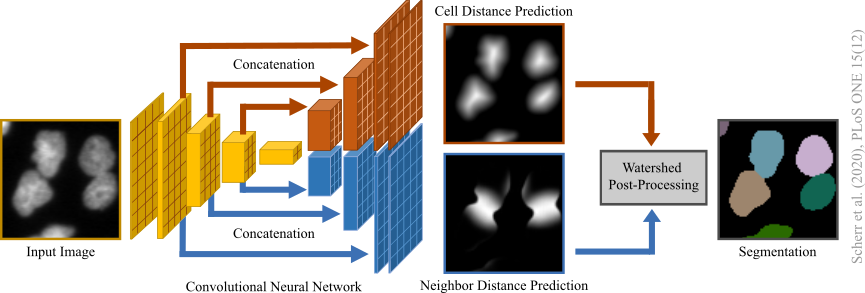

# KIT-GE (3) / KIT-Sch-GE (2) Segmentation

Distance-transform-prediction-based segmentation method used for our submission to the 6th edition of the [ISBI Cell Tracking Challenge](http://celltrackingchallenge.net/) 2021 as team KIT-Sch-GE (2) (now [KIT-GE (3)](http://celltrackingchallenge.net/participants/KIT-GE/)):



A [Google Colab](https://colab.research.google.com/?utm_source=scs-index) notebook can be found in */colab*. Our software tool *microbeSEG* with graphical user interface and OMERO support can be found [here](https://github.com/hip-satomi/microbeSEG).

## Prerequisites
* [Anaconda Distribution](https://www.anaconda.com/products/individual)
* A CUDA capable GPU
* Recommended RAM: 32 GiB
* Recommended VRAM: 24 GiB

## Installation
Clone the repository:
```
git clone https://git.scc.kit.edu/KIT-Sch-GE/2021_segmentation.git
```
Open the Anaconda Prompt (Windows) or the Terminal (Linux), go to the repository and create a new virtual environment:
```
cd path_to_the_cloned_repository
conda env create -f requirements.yml
```
Activate the virtual environment kit-sch-ge-2021_cell_segmentation_ve:
```
conda activate kit-sch-ge-2021_cell_segmentation_ve
``` 

## Download Models
The models of the Cell Tracking Challenge submission KIT-Sch-GE (2) can be downloaded with
```
python download_models.py
``` 
These models were trained on a mixture of gold truth (GT) and silver truth (ST) [annotations](http://celltrackingchallenge.net/annotations/) on a specific cell type which is encoded in the model name. Currently, the following models are available:
- BF-C2DL-HSC_GT+ST_model,
- BF-C2DL-MuSC_GT+ST_model,
- DIC-C2DH-HeLa_GT+ST_model,
- Fluo-C2DL-MSC_GT+ST_model,
- Fluo-C3DH-A549_GT+ST_model,
- Fluo-C3DH-H157_GT+ST_model,
- Fluo-C3DL-MDA231_GT+ST_model,
- Fluo-N2DH-GOWT1_GT+ST_model,
- Fluo-N2DL-HeLa_GT+ST_model,
- Fluo-N3DH-CE_GT+ST_model,
- Fluo-N3DH-CHO_GT+ST_model,
- Fluo-N3DH-SIM+_GT_model (trained also on Fluo-N2DH-SIM+ data),
- PhC-C2DH-U373_GT+ST_model,
- PhC-C2DL-PSC_GT+ST_model,

These models are saved into *./models/kit-sch-ge/* and can be used for retraining, comparison purposes on Cell Tracking Challenge data or may directly generalize to other data when the domain gap is not too large.

## Download Cell Tracking Challenge Data & Evaluation Software
Download all Cell Tracking Challenge Data (without Fluo-N3DL-DRO, Fluo-N3DL-TRIC, Fluo-N3DL-TRIF) with
```
python download_data.py
```
About 40GiB free memory is needed. The training datasets with annotations are saved into *./train_data/* and the challenge data into *./challenge_data/*. In addition the [evaluation software](http://celltrackingchallenge.net/evaluation-methodology/) will be downloaded.
  
## Training
New models can be trained with:
```
python train.py --cell_type "cell_type" --mode "mode"
```
Thereby, the needed training data will be created automatically (may take some time for some ST datasets).

Models can be retrained with:
```
python train.py --cell_type "cell_type" --mode "mode" --retrain "model_name"
```
Trained models are saved into *./models/all/*. 

*train_kit-sch-ge.sh* is a bash script for reproducing the training and evaluation of our whole submission (takes some time!). 

### Training Data
For the training, 320px-by-320px crops are generated. For Cell Tracking Challenge GT data, the detection GT located in the *TRA* folder are used to examine if all cells in a crop are annotated. Only high quality crops are used (with some exceptions if too few crops are available). For the mixture of GT and ST, the amount of STs is limited. The final training sets with for training required distance transforms are saved into *./train_data/* (with a training set name consisting of the cell type, mode and split or for multiple cell types just a hash).

If you want to train models on your own data or to apply trained models to your own data, you need to convert your data into the Cell Tracking Challenge format and add the data to *./train_data/* (best put annotated masks into the GT folders *SEG* and *TRA*). Using the parameter <tt>--cell_type "name_of_your_folder"</tt> in the training will create a training set with crop_size 320px-by-320px and train models with this set.

### Parameters
Defaults are written bold.
- <tt>--act_fun</tt> / <tt>-a</tt>: activation function (**"relu"**, "leakyrelu", "elu", "mish").
- <tt>--batch_size</tt> / <tt>-bs</tt>: batch size (**8**).
- <tt>--cell_type</tt> / <tt>-ct</tt>: cell_type. "all" will train a model on preselected Cell Tracking Challenge datasets. Multiple cell types can be used.
- <tt>--filters</tt> / <tt>-f</tt>: number of kernels (**64 1024**). After each pooling, the number is doubled in the encoder till the maximum is reached.
- <tt>--iterations</tt> / <tt>-i</tt>: number of models trained (**1**).
- <tt>--loss</tt> / <tt>-l</tt>: loss function ("l1", "l2", **"smooth_l1"**).
- <tt>--mode</tt> / <tt>-m</tt>: type of training data / training mode (**"GT"**, "ST", "GT+ST").
- <tt>--multi_gpu</tt> / <tt>-mgpu</tt>: use multiple GPUs if available (**True**).
- <tt>--norm_method</tt> / <tt>-nm</tt>: normalization layer type (**"bn"**, "gn", "in").
- <tt>--optimizer</tt> / <tt>-o</tt>: optimizer (**"adam"**, "[ranger](https://github.com/lessw2020/Ranger-Deep-Learning-Optimizer)").
- <tt>--pool_method</tt> / <tt>-pm</tt>: Pooling method ("max" (maximum pooling), **"conv"** (convolution with stride 2)).
- <tt>--pre_train</tt> / <tt>-pt</tt>: auto-encoder pre-training (only for GT and single cell type).
- <tt>--retrain</tt> / <tt>-r</tt>: model to retrain.
- <tt>--split</tt> / <tt>-s</tt>: data used for train/val split ("kit-sch-ge" (exact reproduction of sets), "01" (use only 01 set for training data creation), "02", **"01+02"**).

### Recommendations and Remarks:
- Use a batch size of 4 or 8. We use 8 with 2 GPUs (effectively 4).
- Use the default settings but try also the Ranger optimizer with mish activation function (<tt>-a "mish" -o "ranger"</tt>) instead of Adam and ReLU (<tt>-a "relu" -o "adam"</tt>).
- auto-encoder pre-training seems not really to help even if only a few GT are available.
- Use the retraining with care. Only a single parameter group is used which may lead to large changes in the first filters and make the subsequent learned filters useless. A more sophisticated retraining, e.g., retraining only the decoders or use multiple learning rates for multiple parameter groups, may be added in future releases 
- The auto-encoder pre-training is always made on both subsets regardless of the <tt>split</tt> parameter.
- If you want to create labels with another method, e.g., boundary labels, you need to adjust the function <tt>generate_data</tt> in *./segmentation/training/create_training_sets.py*

### Examples
Train a model on a training set created from STs of the subset "01" of the dataset Fluo-N2DL-HeLa:
```
python train.py --cell_type "Fluo-N2DL-HeLa" --mode "ST" --split "01"
```
Train two models with Ranger and mish on a training dataset made from BF-C2DL-HSC and BF-C2DL-MuSC:
```
python train.py --cell_type "BF-C2DL-HSC" "BF-C2DL-MuSC" --mode "ST" --act_fun "mish" --optimizer "ranger" --iterations 2
```
Retrain a model:
```
python train.py --cell_type "Fluo-N2DL-HeLa" --mode "ST" --retrain "models/kit-sch-ge/Fluo-N2DL-HeLa_GT+ST_model"
```

## Evaluation
Trained models can be evaluated on the training datasets with (you may need to make the evaluation software executable once):
```
python eval.py  --cell_type "cell_type" --mode "mode"
```
The best model (OP_CSB measure for GT & GT+ST, SEG measure calculated on ST for ST) for the selected cell_type and mode will be copied into *./models/best/*. In the corresponding .json files, the best thresholds and the applied scaling factor can be found (and also some other information). The (raw) results of all evaluated models can be found in *./training_data/cell_type/01_RES_model_name_th_seed_th_cell* and *./training_data/cell_type/02_RES_model_name_th_seed_th_cell*. The metrics are saved in *./models/metrics.csv*.

*eval_kit-sch-ge.sh* is a bash script for the training and evaluation of our whole submission (takes some time!). 

### Parameters
- <tt>--apply_clahe</tt> / <tt>-acl</tt>: CLAHE pre-processing.
- <tt>--apply_merging</tt> / <tt>-am</tt>: Merging post-processing (only 2D, can resolve oversegmentation but may lead to undersegmentation)
- <tt>--artifact_correction</tt> / <tt>-ac</tt>: Motion-based artifact correction post-processing (only for 2D and dense data).
- <tt>--batch_size</tt> / <tt>-bs</tt>: batch size (**8**).
- <tt>--fuse_z_seeds</tt> / <tt>-fzs</tt>: Fuse seeds in axial direction (only for 3D).
- <tt>--mode</tt> / <tt>-m</tt>: type of training data / evaluation mode (**"GT"**, "ST").
- <tt>--models</tt>: Models to evaluate.
- <tt>--multi_gpu</tt> / <tt>-mgpu</tt>: use multiple GPUs if available (**True**).
- <tt>--n_splitting</tt>: Threshold of detected cells to apply splitting post-processing (**40**, only 3D).
- <tt>--save_raw_pred</tt> / <tt>-srp</tt>: save some raw/distance predictions.
- <tt>--scale</tt> / <tt>-sc</tt>: Scale factor (**0**, 0 means that the information is loaded from corresponding training set .json file).
- <tt>--split</tt> / <tt>-s</tt>: Subset for evaluation ("01" (use only 01 set), "02", **"01+02"**).
- <tt>--th_cell</tt>/ <tt>-tc</tt>: Threshold(s) for adjusting cell size (**0.07**).
- <tt>--th_seed</tt> / <tt>-ts</tt>: Threshold(s) for seed extraction (**0.45**).

### Recommendations and Remarks
- Use a lower batch size for large image sizes or 3D data depending on your VRAM.
- If you want to evaluate on your own data, the dataset name / cell type should include "2D" for 2D data and "3D" for 3D data.
- All models which begin with <tt>--models "model_prefix"</tt> will be evaluated and the best model will be selected and copied to *./models/best/"*
- Some cell types are excluded for finding the best model evaluations with more than 1 cell type given (since they are quite different and the idea is to find a better model for the remaining cell types).
- A list with metrics for each subset and cell type of each model can be found after the evaluation at *./models/best/.
- Use release 2.1 for exact reproduction of our submission results with the downloaded models. We expect the OP_CSB scores to improve by up to 0.02 depending on the dataset after internal tests using the current code version (better neighbor distance normalization --> better training and less wrong splits, less smoothing in post-processing better --> better cell shapes).

### Examples
Evaluate all models which begin with "Fluo-N2DL-HeLa_ST_01_model" (trained on subset "01", stored in *./models/all*) for multiple thresholds on subset "02":
```
python eval.py --cell_type "Fluo-N2DL-HeLa" --mode "GT" --models "Fluo-N2DL-HeLa_ST_01_model" --artifact_correction --th_cell 0.07 0.09 --th_seed 0.35 0.45 --subset "02"
```
Evaluate the models which begin with "BF-C2DL-HSC_GT+ST" (in *./models/all*) on multiple cell types and select the model which performs best:
```
python eval.py --cell_type "BF-C2DL-HSC" "BF-C2DL-MuSC" --mode "GT" --models "BF-C2DL-HSC_GT+ST" --artifact_correction
```

## Inference
For inference, select a model and run:
```
python infer.py --cell_type "cell_type" --model "model"
```
The results can be found in *./challenge_datasets/cell_type*.

*inference_kit-sch-ge.sh* is a bash script to reproduce our results.

### Parameters
- <tt>--apply_clahe</tt> / <tt>-acl</tt>: CLAHE pre-processing.
- <tt>--apply_merging</tt> / <tt>-am</tt>: Merging post-processing (only 2D, can resolve oversegmentation but may lead to undersegmentation)
- <tt>--artifact_correction</tt> / <tt>-ac</tt> : Motion-based artifact correction post-processing (only for 2D and dense data).
- <tt>--batch_size</tt> / <tt>-bs</tt>: batch size (**8**).
- <tt>--fuse_z_seeds</tt> / <tt>-fzs</tt>: Fuse seeds in axial direction (only for 3D).
- <tt>--model</tt>: Model to use.
- <tt>--multi_gpu</tt>  / <tt>-mgpu</tt>: use multiple GPUs if available (**True**).
- <tt>--n_splitting</tt>: Threshold of detected cells to apply splitting post-processing (**40**, only 3D).
- <tt>--save_raw_pred</tt> / <tt>-srp</tt>: save some raw/distance predictions.
- <tt>--scale</tt> / <tt>-sc</tt>: Scale factor (**0**, 0 means that the information is loaded from corresponding training set .json file).
- <tt>--split</tt> / <tt>-s</tt>: Subset for evaluation ("01" (use only 01 set), "02", **"01+02"**).
- <tt>--th_cell</tt> / <tt>-tc</tt>: Threshold for adjusting cell size (**0.07**).
- <tt>--th_seed</tt> / <tt>-ts</tt>: Threshold for seed extraction (**0.45**).

### Recommendations and Remarks
- Use a lower batch size for large image sizes or 3D data depending on your VRAM.
- If you want to process on your own data, the dataset name / cell type should include "2D" for 2D data and "3D" for 3D data.
- Like for the training datasets, your own data need to be in the Cell Tracking Challenge format and lie in *./challenge_data/* (no ground truths needed this time).

### Examples
Process multiple datasets with the same model and save some raw predictions
```
python infer.py --cell_type "BF-C2DL-HSC" "BF-C2DL-MuSC" --model "best/BF-C2DL-HSC_GT_01+02_model" --save_raw_pred
```

## Releases

### [3.0](https://github.com/TimScherr/KIT-GE-3-Cell-Segmentation-for-CTC/releases/tag/v3.0)
 - Neighbor distance map normalization for elongated objects fixed,
 - Google Colab notebook added.

### [2.1](https://git.scc.kit.edu/KIT-Sch-GE/2021_segmentation/-/releases/v2.1)
 - Merging post-processing added.

### [2.0](https://git.scc.kit.edu/KIT-Sch-GE/2021_segmentation/-/releases/v2.0)
 - Improved code usability,
 - adjusted training data creation,
 - original training data sets can be reproduced using the parameter <tt>split</tt>.

### [1.0](https://git.scc.kit.edu/KIT-Sch-GE/2021_segmentation/-/releases/v1.0)
 - Original code of our Cell Tracking Challenge contribution.

## Publications
T. Scherr, K. Löffler, M. Böhland, and R. Mikut (2020). Cell Segmentation and Tracking using CNN-Based Distance Predictions and a Graph-Based Matching Strategy. PLoS ONE 15(12). DOI: [10.1371/journal.pone.0243219](https://doi.org/10.1371/journal.pone.0243219).

T. Scherr, K. Löffler, O. Neumann, and R. Mikut (2021). On Improving an Already Competitive Segmentation Algorithm for the Cell Tracking Challenge - Lessons Learned. bioRxiv. DOI: [10.1101/2021.06.26.450019](https://doi.org/10.1101/2021.06.26.450019).

## License
This project is licensed under the MIT License - see the [LICENSE.md](LICENSE.md) file for details.
